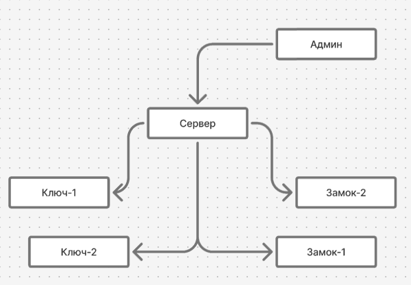
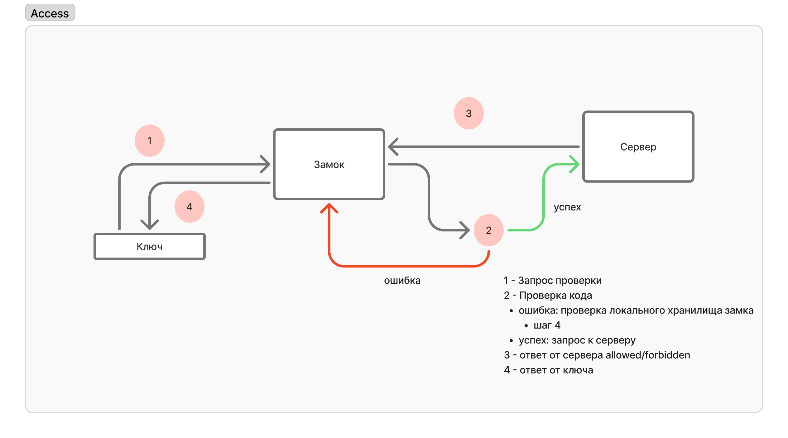
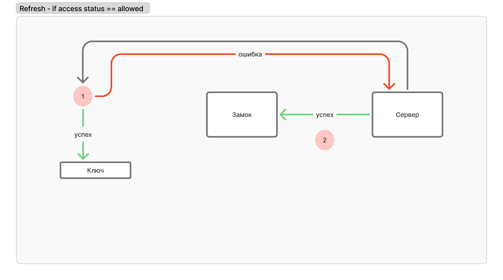

# access-control

1. **Кейс** - Инфотекс(Разработка системы безопасности управления доступом)
2. **План**
- [ ] Сервер для управления ключами и замками
- [ ] Эмуляция ключа
- [ ] Эмуляция замка

**Стек**
- [ ] Сервер - FastAPI [[Репозиторий с бекендом]](https://github.com/HITSEdu/access-control-api)
- [ ] Клиент администратора - React [[Репозиторий с фронтендом]](https://github.com/HITSEdu/access-control-frontend)
- [ ] Эмуляция ключа и замка - C++
- [ ] Алгоритм - OpenSSL(HMAC SHA256)

3. **Дополнительно**
- Админка
- Управление сроком жизни ключа
- Изменения пароля после успешной верификации ключа
- Замок ограничивает количество попыток
- История доступа

